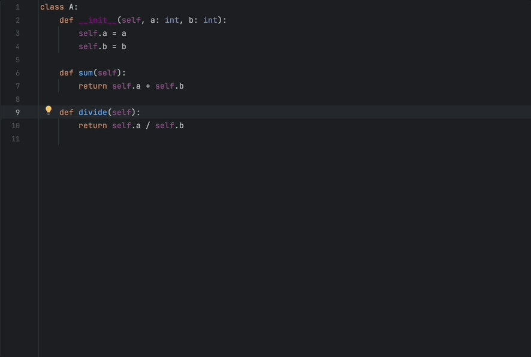

<p align="center">
    
    <h1 align="center">gpt4docstrings</h1>
    <h3 align="center">Generating Python docstrings with OpenAI ChatGPT!!</h3>
</p>

---

[][pypi_]
[][status]
[][python version]
[][license]

[][read the docs]
[][tests]
[][codecov]

[][pre-commit]
[][black]

[pypi_]: https://pypi.org/project/gpt4docstrings/
[status]: https://pypi.org/project/gpt4docstrings/
[python version]: https://pypi.org/project/gpt4docstrings
[read the docs]: https://gpt4docstrings.readthedocs.io/
[tests]: https://github.com/MichaelisTrofficus/gpt4docstrings/actions?workflow=Tests
[codecov]: https://app.codecov.io/gh/MichaelisTrofficus/gpt4docstrings
[pre-commit]: https://github.com/pre-commit/pre-commit
[black]: https://github.com/psf/black

## What is `gpt4docstrings`?

`gpt4docstrings` is a library that helps you to write docstrings
for your Python code. Select a path / paths where you want `gpt4docstrings`
to be applied and wait for the results!!



## Requirements

`gpt4docstrings` supports Python 3.9 and above.

## Installation

> **Warning:** At the moment, this library is under heavy development, so it is recommended to always install
> the latest version.
>
> You can install _gpt4docstrings_ via [pip] from [PyPI]:

```console
$ pip install -U gpt4docstrings
```

## Usage

To run `gpt4docstrings` on a specific file, run this command.

```bash
gpt4docstrings my_file.py
```

Remember that, if you don't have your OpenAI API Key defined as an Environment Variable (OPENAI_API_KEY),
`gpt4docstrings` can accept the API Key as an option.

```bash
gpt4docstrings --api_key sk-xxxxxxxxxxxx my_file.py
```

Be aware that, as a safety measure , `gpt4docstrings` won't overwrite the file in place.
Instead, it will generate a `patch` called `gpt4docstring_docstring_generator_patch.diff`
that contains the information about all the changes.

If you want to apply the `patch` to the file, simply run:

```bash
patch -p1 < gpt4docstring_docstring_generator_patch.diff
```

In case you don't want to generate a `patch` file and modify the files in place, you'll
need to add the `--overwrite, -w` option:

```bash
gpt4docstrings -w my_file.py
```

You can also apply `gpt4docstrings` to folders recursively.

```bash
gpt4docstrings src/
```

Another quite common situation is that you may want to exclude the `tests/` folder, for example,
from the generation of docstrings. Doing this is very simple.

```bash
gpt4docstrings --exclude tests/ src/
```

By default, `gpt4docstrings` generates `google` style docstrings. However,
you can choose between: `google`, `numpy`, `epytext`, `reStructuredText`.

You can specify the docstring style using the `-st` option. For example:

```bash
gpt4docstrings -st epytext my_file.py
```

For more information about all the available options, you can check
the `help` info:

```
Usage: gpt4docstrings [OPTIONS] [PATHS]...

Options:
  -h, --help                      Show this message and exit.
  -S, --ignore-setters            Ignore methods with property setter
                                  decorators.
  -P, --ignore-property-decorators
                                  Ignore methods with property setter/getter
                                  decorators.
  -n, --ignore-nested-functions   Ignore nested functions and methods.
  -C, --ignore-nested-classes     Ignore nested classes.
  -i, --ignore-init-method        Ignore `__init__` method of classes.
  -s, --ignore-semiprivate        Ignore semiprivate classes, methods, and
                                  functions starting with a single underscore.
  -p, --ignore-private            Ignore private classes, methods, and
                                  functions starting with two underscores.
                                  [default: False]
  -w, --overwrite                 If `True`, it will directly write the
                                  docstrings into the files (it will not
                                  generate git patches)
  -v, --verbose INTEGER           Verbosity parameter. Defaults to 0.
  -e, --exclude PATH              Exclude PATHs of files and/or directories.
                                  Multiple `-e/--exclude` invocations
                                  supported.
  -k, --api_key TEXT              OpenAI's API key. If not provided,
                                  `gpt4docstrings` will try to access
                                  `OPENAI_API_KEY` environment variable.
  -st, --style TEXT               Docstring style, which must be one of
                                  'google', 'reStructuredText', 'epytext',
                                  'numpy'
  -m, --model TEXT                The model to be used by `gpt4docstrings`. By
                                  default, `gpt-3.5-turbo`.
```

I also encourage you to see the [Command-line Reference] for more details!!

## Example

Here is a full example using `gpt4docstring` to generate docstrings
for the python code inside `example/example.py`.

```python
import asyncio


async def async_example():
    await asyncio.sleep(2)


class MyClass:

    def __init__(self, value):
        self.value = value

    @staticmethod
    def nested_method():
        def inner_function():
            print("Nested method inner function")
        print("Nested method start")
        inner_function()
        print("Nested method completed")
```

We'll create `numpy` docstrings in this case and will generate a patch file (default) instead of directly overwriting
the file directly. We'll also increase the level of verbosity to see some additional information.

> **Warning:** We are assuming you already have the OpenAI API Key set as an Environment Variable. Otherwise, this
> example won't work.

```
gpt4docstrings example/example.py -v 1 -st numpy
```


After it finishes documenting, we should see a new patch file on our directory called `gpt4docstring_docstring_generator_patch.diff`.

```patch
--- a//Users/moteroperdido/Desktop/projects/gpt4docstrings/example/example.py
+++ b//Users/moteroperdido/Desktop/projects/gpt4docstrings/example/example.py
@@ -2,17 +2,78 @@


 async def async_example():
+    """
+    An asynchronous example function.
+
+    This function demonstrates the use of the `async` keyword and `asyncio.sleep()` to create an asynchronous delay.
+
+    Returns
+    -------
+    None
+        This function does not return any value.
+
+    Raises
+    ------
+    None
+        This function does not raise any exceptions.
+    """
     await asyncio.sleep(2)


 class MyClass:

+    """
+    A class representing MyClass.
+
+    Parameters
+    ----------
+    value : any
+        The initial value for MyClass.
+
+    Methods
+    -------
+    nested_method()
+        A static method that demonstrates nested functions.
+    """
     def __init__(self, value):
+        """
+        Initialize a new instance of the class.
+
+        Parameters
+        ----------
+        value : any
+            The value to assign to the instance variable.
+
+        Returns
+        -------
+        None
+        """
         self.value = value

     @staticmethod
     def nested_method():
+        """
+        Perform a nested method execution.
+
+        This method has an inner function that is called within the outer method.
+
+        Parameters
+        ----------
+        None
+
+        Returns
+        -------
+        None
+        """
         def inner_function():
+            """
+            This function is an inner function with no parameters or return values.
+
+            Raises
+            ------
+            None
+                This function does not raise any exceptions.
+            """
             print("Nested method inner function")
         print("Nested method start")
         inner_function()
```

To apply the patch, simply run:

```bash
patch -p1 < gpt4docstring_docstring_generator_patch.diff
```

## Contributing

Contributions are very welcome.
To learn more, see the [Contributor Guide].

## License

Distributed under the terms of the [MIT license][license],
_gpt4docstrings_ is free and open source software.

## Issues

If you encounter any problems,
please [file an issue] along with a detailed description.

## Credits

This project was generated from [@cjolowicz]'s [Hypermodern Python Cookiecutter] template.

[@cjolowicz]: https://github.com/cjolowicz
[pypi]: https://pypi.org/
[hypermodern python cookiecutter]: https://github.com/cjolowicz/cookiecutter-hypermodern-python
[file an issue]: https://github.com/MichaelisTrofficus/gpt4docstrings/issues
[pip]: https://pip.pypa.io/

<!-- github-only -->

[license]: https://gpt4docstrings.readthedocs.io/en/latest/license.html
[contributor guide]: https://gpt4docstrings.readthedocs.io/en/latest/contributing.html#
[command-line reference]: https://gpt4docstrings.readthedocs.io/en/latest/use_as_cli.html
